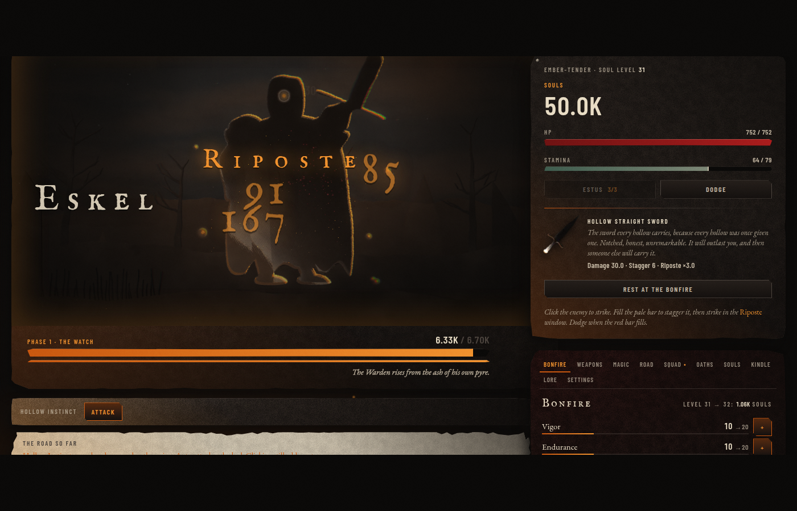
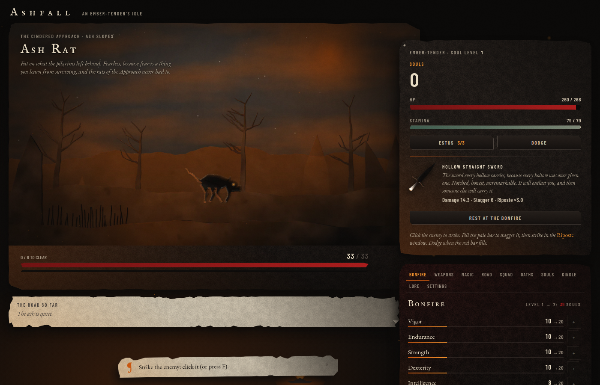

# Ashfall — screenshots

Captured headless at 1400×900 from the built game (`npm run build && npx vite preview`), by the scripts in `scripts/`. Every frame is the live UI: no compositing, no retouching. The three the brief names first.

## The three that have to sit on a Steam page

| | |
|---|---|
|  | **Boss intro.** Eskel, Warden of the Cold Pyre, arriving: letterbox, the name card with its ember rule, the epithet, the lore; the page beyond the frame steps back. Unskippable the first time you meet him. |
|  | **The riposte moment.** The window is open: the figure rim-lit in ember, the chromatic edge, the display-face numbers, the poise gauge blown. |
|  | **The road, at rest.** The Cindered Approach under an ash sky, the hub slab overlapping the frame, a hint on torn parchment. |

## The rest of the game

| | |
|---|---|
|  | **The bestiary.** A parchment page per foe, the plate in sepia, the numbers underneath. |
|  | **Every tab.** Weapons with icon crops, spells with their rings, the Road with region strips, the squad with portraits, oaths with wax seals, souls, the Kindle, the Sigil, lore, settings. |
|  | **The seven regions in-game.** Approach, Mire, Archive, Sanctum, Deep, Kiln, Abyss. |
|  | **The Kindling ritual** in five moments: the fire dies, what you carried rises as ash, what you know stays, the ember catches, the next burning is named. |
|  | **The Humanity tree**, an illuminated page. |
|  | **Boss card, YOU DIED, an open lore page, the away report.** |

## The plates

| | |
|---|---|
|  | Every enemy and phantom on parchment, the hardest ground. |
|  | The eighteen lords. |
|  | Thirty-two weapons; enchanted blades carry a hot edge. |
|  | Spell rings, covenant seals, materials. |
|  | The silhouette sheet at 100px: sixty-one subjects in pure ink. |

## Bible sheets

`art/palette.png`, `art/type.png`, `art/mockups/{A,B,C}.png` — the palette, the type specimen, and the three style-target mockups from Milestone 1.
